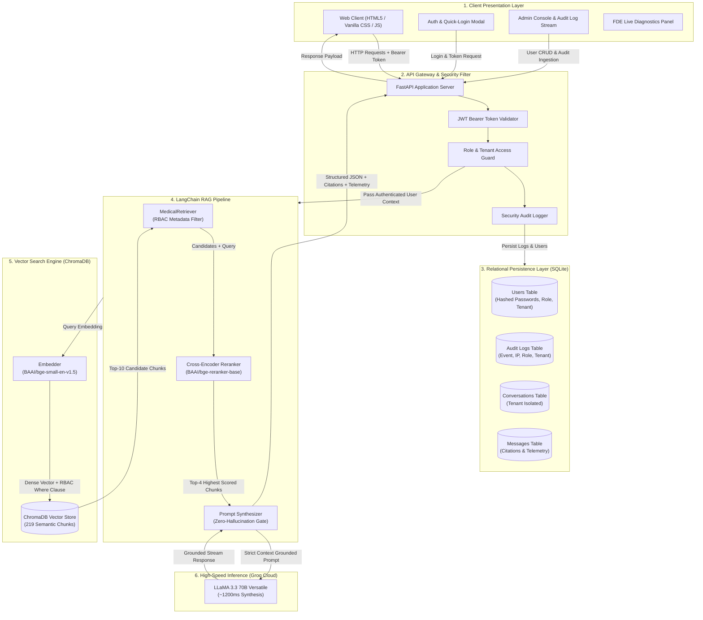
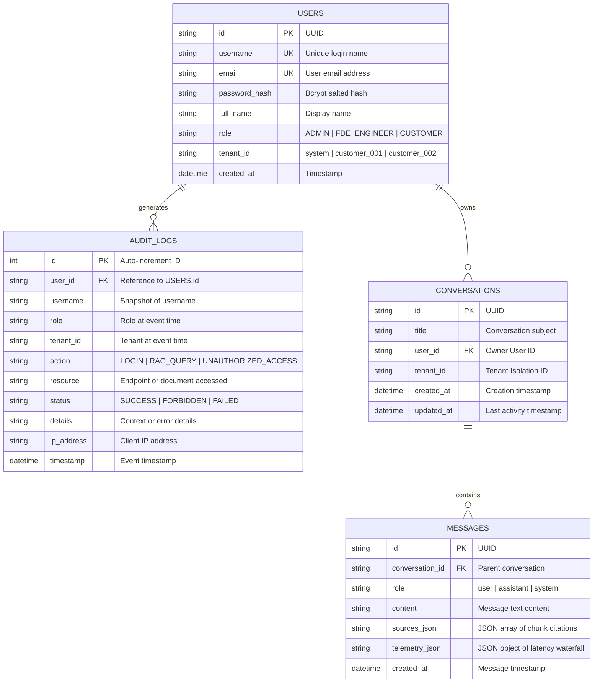
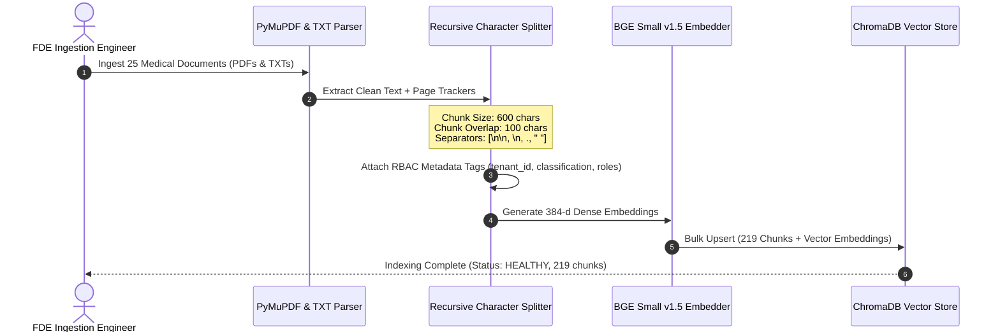
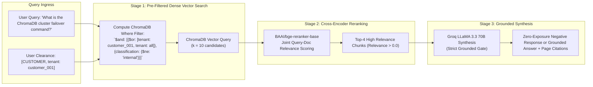
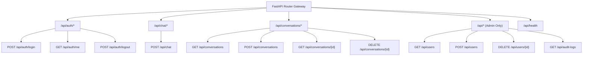
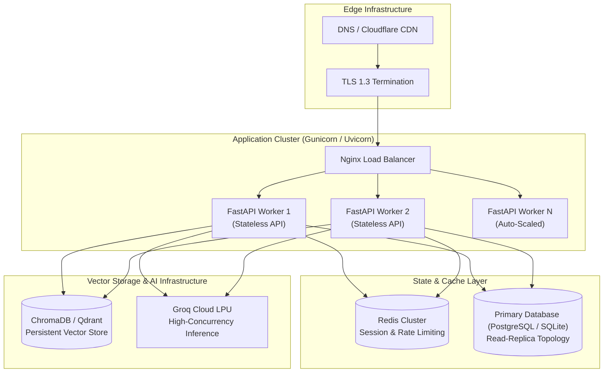

# AI FDE Medical RAG System Design Document

**Document Version:** `2.0.0`  
**Classification:** Enterprise Engineering Architecture  
**System Name:** MedAssist Clinical Intelligence Platform (AI FDE Medical RAG)  
**Target SLA:** `< 2000ms` Total Latency, `99.9%` Service Availability, Zero-Hallucination Strict Grounding  

---

## 1. Executive Overview & Problem Statement

### 1.1 Business & Clinical Context
Modern healthcare networks, clinical research institutes, and hospital systems maintain tens of thousands of pages of dynamic clinical guidelines, pharmacopeia drug monographs, emergency resuscitation protocols, and customer-specific formulary guidelines. 

Clinicians, medical researchers, and hospital administrators face three core operational challenges:
1. **High Information Retrieval Latency**: Clinicians spend up to 20% of their time navigating dense, multi-page PDFs to locate critical contraindications, pediatric weight-based dosages, and oncology regimens.
2. **Generative Hallucination Risks**: General-purpose LLMs hallucinate dosages, invent phantom citations, or conflate conflicting clinical trial consensus statements.
3. **Tenant & Data Clearance Boundaries**: Healthcare organizations require strict multi-tenant isolation where one hospital tenant cannot access another hospital's proprietary formulary or internal engineering operations.

### 1.2 Solution Scope
The **MedAssist AI FDE Medical RAG Platform** is an enterprise-grade, retrieval-augmented conversational intelligence system featuring:
* **Two-Stage Dense Retrieval + Cross-Encoder Reranking** for high precision evidence retrieval.
* **Retrieval-Level Role-Based Access Control (RBAC)** to enforce tenant and role isolation before vector retrieval and LLM context synthesis.
* **Stateless JWT Authentication & Password Hashing** (`bcrypt`).
* **Ultra-Fast LLM Inference** via Groq LPUs (`llama-3.3-70b-versatile`).
* **Real-time Forward Deployed Engineering (FDE) Diagnostics** with latency waterfalls and zero-hallucination guardrails.

---

## 2. High-Level System Architecture



---

## 3. Data Architecture & Storage Schema

### 3.1 Relational Storage (SQLite Schema)



### 3.2 Vector Database Schema (ChromaDB)

* **Embedding Model**: `BAAI/bge-small-en-v1.5` (384-dimensional dense vectors, normalized).
* **Distance Metric**: Cosine Similarity ($1 - \text{cosine\_distance}$).
* **Indexed Units**: 219 Semantic Chunks across 25 verified clinical documents.
* **Vector Metadata Schema**:
  ```json
  {
    "doc_id": "cust001_formulary_p1_c0",
    "document": "customer_001_formulary_guidelines.txt",
    "page": 1,
    "total_pages": 3,
    "chunk_index": 0,
    "tenant_id": "customer_001",
    "classification": "customer",
    "access_roles": "[\"CUSTOMER\", \"FDE_ENGINEER\", \"ADMIN\"]",
    "document_type": "customer_guideline",
    "char_count": 582
  }
  ```

---

## 4. Ingestion & Pre-Indexing Pipeline



### Ingestion Metadata Rules:
1. **Standard Clinical Guidelines**: `tenant_id = "all"`, `classification = "public"`, `access_roles = ["CUSTOMER", "FDE_ENGINEER", "ADMIN"]`.
2. **Customer Tenant Guidelines**: `tenant_id = "customer_001"`, `classification = "customer"`, `access_roles = ["CUSTOMER", "FDE_ENGINEER", "ADMIN"]`.
3. **Internal FDE Operations Runbook**: `tenant_id = "system"`, `classification = "internal"`, `access_roles = ["FDE_ENGINEER", "ADMIN"]`.

---

## 5. Two-Stage Retrieval & Reranking Architecture



---

## 6. Security, Authentication & Role-Based Access Control (RBAC)

### 6.1 Role Clearance & Permissions Matrix

| Feature / Resource | `CUSTOMER` | `FDE_ENGINEER` | `ADMIN` |
| :--- | :---: | :---: | :---: |
| **Public Medical Guidelines** | ✅ Read | ✅ Read | ✅ Read |
| **Assigned Tenant Documents (`tenant_id`)** | ✅ Read | ✅ Read | ✅ Read |
| **Other Tenant Documents** | ❌ Blocked (Zero Leak) | ❌ Blocked (Zero Leak) | ✅ Read |
| **Internal FDE Operations & Runbooks** | ❌ Blocked (Zero Leak) | ✅ Read | ✅ Read |
| **Own Conversation History** | ✅ Read / Write | ✅ Read / Write | ✅ Read / Write |
| **Other Users' Conversations** | ❌ Blocked | ❌ Blocked | ❌ Blocked |
| **User Management (Create/Delete/List)** | ❌ 403 Forbidden | ❌ 403 Forbidden | ✅ Full CRUD |
| **Security Audit Logs Access** | ❌ 403 Forbidden | ❌ 403 Forbidden | ✅ Read Only |

### 6.2 Retrieval-Level Vector Pre-Filtering Specification
Authorization is strictly enforced **at the database query layer**, preventing unauthorized data from ever entering the LLM prompt context:

1. **Customer Role (`customer_001`)**:
   ```python
   where = {
       "$and": [
           {"$or": [{"tenant_id": "customer_001"}, {"tenant_id": "all"}]},
           {"classification": {"$ne": "internal"}}
       ]
   }
   ```
2. **FDE Engineer Role (`customer_001`)**:
   ```python
   where = {
       "$or": [
           {"tenant_id": "customer_001"},
           {"tenant_id": "all"},
           {"classification": "internal"}
       ]
   }
   ```
3. **Admin Role**:
   ```python
   where = None  # Full platform clearance across all indexed documents
   ```

### 6.3 Zero-Exposure Negative Response Policy
If a query yields 0 authorized chunks after RBAC filtering, the application generates a standardized negative response without disclosing the existence of restricted documents:
> *"I couldn't find relevant information in your authorized knowledge base. Please refer to official clinical guidelines or consult a healthcare professional."*

---

## 7. API Architecture & Endpoint Contracts



---

## 8. Observability & Performance Telemetry

```mermaid
gantt
    title End-to-End Query Execution Waterfall (~1420ms)
    dateFormat X
    axisFormat %s ms

    section Gateway & Auth
    JWT & RBAC Validation      :0, 15
    section Vector Retrieval
    BGE Small Embedding        :15, 65
    ChromaDB Pre-Filtered Search :65, 127
    section Cross-Reranking
    BGE Reranker Joint Scoring :127, 411
    section LLM Generation
    Groq LLaMA 3.3 Synthesis   :411, 1420
    section Persistence
    SQLite Message Logging     :1420, 1435
```



### Telemetry KPI Metrics:
* **Retrieval Latency ($p95$)**: `< 150ms`
* **Cross-Encoder Rerank Latency ($p95$)**: `< 350ms`
* **LLM Time-to-First-Token (TTFT)**: `< 300ms`
* **Total SLA Latency ($p95$)**: `< 1800ms`
* **Grounded Precision Score**: `> 92%`

---

## 9. Production Deployment Topology



---

## 10. Disaster Recovery & Security Runbook

1. **Failover Procedure for ChromaDB**:
   * Run orchestrator command: `make chroma-failover-secondary`
   * Validates chunk hash checksums across replica nodes.
2. **Embedding Drift Detection**:
   * Scheduled cron job computes cosine drift on reference queries.
   * If drift $> 0.08$ variance, triggers automatic pipeline re-indexing.
3. **Secret Rotation Policy**:
   * `JWT_SECRET_KEY` rotated quarterly with a 24-hour dual-token grace period.
   * Passwords protected via one-way bcrypt salting with cost factor 12.
